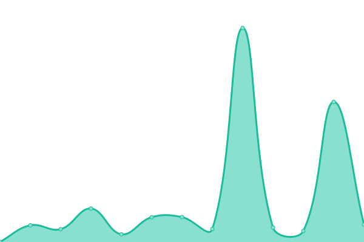

# [📈 Live Status](https://andanotherusername.github.io/upptime-test): <!--live status--> **🟧 Partial outage**

This repository contains the open-source uptime monitor and status page for [Debdut Chakraborty](https://andanotherusername.github.io/upptime-test), powered by [Upptime](https://github.com/upptime/upptime).

With [Upptime](https://upptime.js.org), you can get your own unlimited and free uptime monitor and status page, powered entirely by a GitHub repository. We use [Issues](https://github.com/andanotherusername/upptime-test/issues) as incident reports, [Actions](https://github.com/andanotherusername/upptime-test/actions) as uptime monitors, and [Pages](https://andanotherusername.github.io/upptime-test) for the status page.

<!--start: status pages-->
<!-- This summary is generated by Upptime (https://github.com/upptime/upptime) -->
<!-- Do not edit this manually, your changes will be overwritten -->
<!-- prettier-ignore -->
| URL | Status | History | Response Time | Uptime |
| --- | ------ | ------- | ------------- | ------ |
|  [Google](https://www.google.com) | 🟩 Up | [google.yml](https://github.com/andanotherusername/upptime-test/commits/master/history/google.yml) | 

 57ms
     
 | 

<a href="https://andanotherusername.github.io/upptime-test/history/google">100.00%</a>
    

|  [Wikipedia](https://en.wikipedia.org) | 🟩 Up | [wikipedia.yml](https://github.com/andanotherusername/upptime-test/commits/master/history/wikipedia.yml) | 

 52ms
     
 | 

<a href="https://andanotherusername.github.io/upptime-test/history/wikipedia">100.00%</a>
    

|  [It's FOSS](https://itsfoss.com) | 🟩 Up | [it-s-foss.yml](https://github.com/andanotherusername/upptime-test/commits/master/history/it-s-foss.yml) | 

 162ms
     
 | 

<a href="https://andanotherusername.github.io/upptime-test/history/it-s-foss">100.00%</a>
    

|  [Linux Handbook](https://linuxhandbook.com) | 🟩 Up | [linux-handbook.yml](https://github.com/andanotherusername/upptime-test/commits/master/history/linux-handbook.yml) | 

 1510ms
     
 | 

<a href="https://andanotherusername.github.io/upptime-test/history/linux-handbook">99.79%</a>
    

|  [Open Movies](https://openmovies.in) | 🟩 Up | [open-movies.yml](https://github.com/andanotherusername/upptime-test/commits/master/history/open-movies.yml) | 

 1035ms
     
 | 

<a href="https://andanotherusername.github.io/upptime-test/history/open-movies">99.55%</a>
    

|  [Open Experiment](https://openexperiment.in) | 🟥 Down | [open-experiment.yml](https://github.com/andanotherusername/upptime-test/commits/master/history/open-experiment.yml) | 

 0ms
     
 | 

<a href="https://andanotherusername.github.io/upptime-test/history/open-experiment">0.00%</a>
    

<!--end: status pages-->

[**Visit our status website →**](https://andanotherusername.github.io/upptime-test)

## 📄 License

- Powered by: [Upptime](https://github.com/upptime/upptime)
- Code: [MIT](./LICENSE) © [Debdut Chakraborty](https://andanotherusername.github.io/upptime-test)
- Data in the `./history` directory: [Open Database License](https://opendatacommons.org/licenses/odbl/1-0/)
